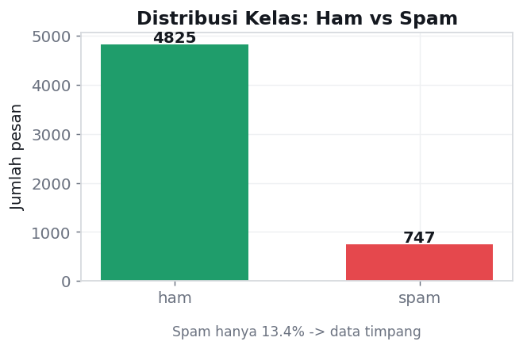
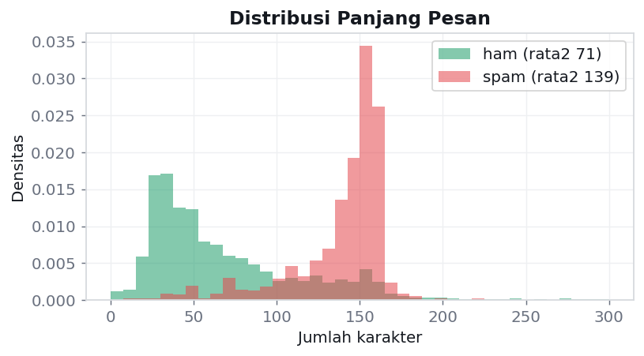
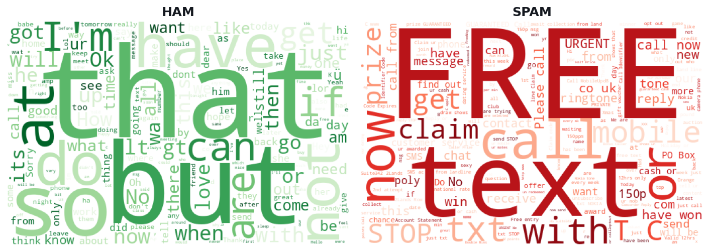
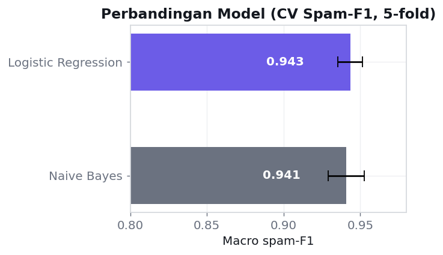
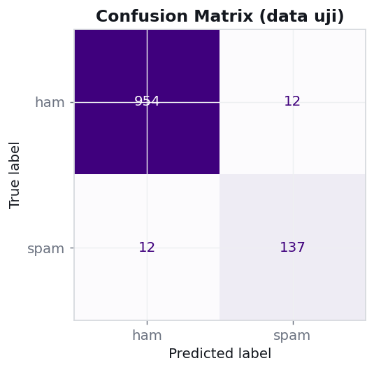
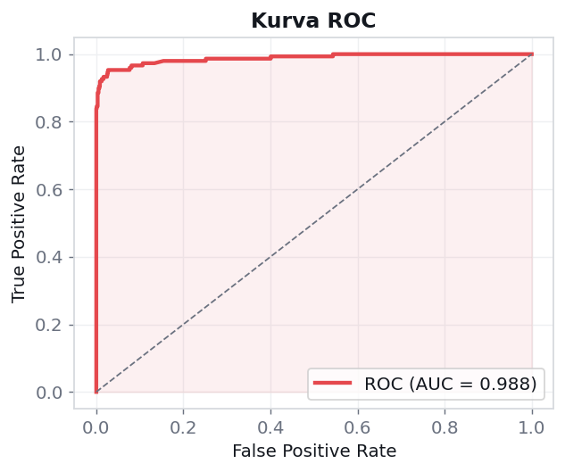
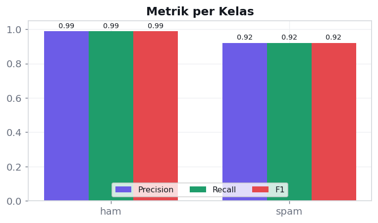
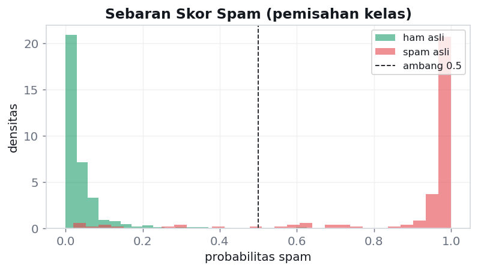
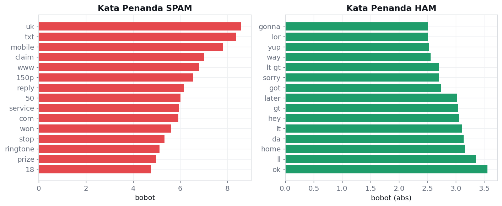

# 📱 SMS Spam Detection — Text Mining Project

> Klasifikasi otomatis pesan SMS menjadi **spam** atau **ham (sah)** menggunakan *machine learning*, lengkap dengan aplikasi web interaktif yang menampilkan prediksi **beserta alasannya**.

    

---

## 📑 Daftar Isi
1. [Executive Summary](#-executive-summary)
2. [Latar Belakang & Tujuan](#-latar-belakang--tujuan)
3. [Dataset](#-dataset)
4. [Metodologi](#-metodologi-alur-text-mining)
5. [Hasil & Visualisasi](#-hasil--visualisasi)
6. [Interpretasi & Insight](#-interpretasi--insight)
7. [Aplikasi Web](#-aplikasi-web-smish)
8. [Cara Menjalankan](#-cara-menjalankan)
9. [Struktur Proyek](#-struktur-proyek)
10. [Keterbatasan](#-keterbatasan)
11. [Pengembangan Lanjutan](#-pengembangan-lanjutan-future-work)
12. [Referensi & Lisensi](#-referensi)

---

## 📄 Executive Summary

**Masalah.** Spam SMS bukan sekadar gangguan — ia kerap menjadi pintu masuk penipuan (*smishing*): tautan palsu, undian bohong, dan pencurian data. Menyaringnya secara manual tidak praktis karena volumenya besar dan polanya terus berubah.

**Solusi.** Proyek ini melatih **satu model machine learning** yang membaca isi SMS dan memutuskan apakah pesan itu spam. Model belajar dari 5.572 pesan nyata, menemukan sendiri pola bahasa pembeda spam dari percakapan biasa, lalu memberi prediksi disertai skor keyakinan.

**Cara kerja ringkas.** Teks mentah diubah menjadi angka lewat **TF-IDF** (pembobotan kata khas), lalu **Logistic Regression** mempelajari kata mana yang menandai spam. Ini alur *text mining* klasik — cabang sah dari data mining.

**Hasil utama.** Pada data uji yang belum pernah dilihat model:

| Metrik | Nilai | Arti praktis |
|---|---|---|
| **Spam F1-score** | **~0,92** | Seimbang antara menangkap spam & tak salah tuduh |
| **Akurasi** | **~0,98** | 98 dari 100 pesan benar |
| **ROC-AUC** | **~0,99** | Pemisahan spam vs ham hampir sempurna |
| **False positive** | **Sangat rendah** | Pesan penting nyaris tak pernah salah blokir |

**Deliverable.** (1) Notebook Colab berisi seluruh pipeline yang dapat dijalankan ulang, dan (2) aplikasi web **Streamlit "Smish"** — pengguna menempel SMS, melihat verdict, skor spam, dan **kata pemicu yang disorot**, sehingga keputusan model transparan.

---

## 🎯 Latar Belakang & Tujuan

Layanan SMS masih dipakai luas untuk OTP, notifikasi bank, dan komunikasi pribadi — sekaligus menjadi kanal favorit pelaku penipuan. Filter berbasis aturan (mis. blokir kata tertentu) mudah dielakkan karena pelaku terus mengganti kata. Pendekatan **pembelajaran dari data** lebih adaptif karena model menangkap pola statistik, bukan aturan kaku.

**Tujuan proyek:**
1. Mendemonstrasikan siklus data mining lengkap pada dataset teks publik yang bersih.
2. Melatih **satu** model klasifikasi yang akurat sekaligus **dapat dijelaskan**.
3. Men-deploy model ke aplikasi web sederhana agar dapat dipakai pengguna non-teknis.

---

## 📊 Dataset

**SMS Spam Collection** — UCI Machine Learning Repository (ID 228), dikumpulkan oleh Almeida & Gómez Hidalgo (2011).

| Atribut | Nilai |
|---|---|
| Jumlah pesan | 5.572 |
| Kelas | `ham` (sah) dan `spam` |
| Proporsi spam | 13,4% (data timpang) |
| Missing value | 0 |
| Bahasa | Inggris |
| Lisensi | CC BY 4.0 |

Distribusi kelas dan panjang pesan:



Pesan spam cenderung **jauh lebih panjang** (rata-rata ~139 vs ~71 karakter) karena menjejalkan promosi, tautan, dan ajakan bertindak:



---

## 🔬 Metodologi (Alur Text Mining)

| Tahap | Yang dilakukan |
|---|---|
| **1. Data Understanding** | Memeriksa dimensi, proporsi ham/spam, duplikat, panjang pesan |
| **2. EDA** | Distribusi kelas, distribusi panjang, *word cloud* kosakata dominan |
| **3. Data Preparation** | **TF-IDF** (unigram+bigram, buang stopword Inggris, `min_df=2`, `sublinear_tf`); *stratified* split 80/20; vectorizer di dalam `Pipeline` untuk cegah *data leakage* |
| **4. Modeling** | Banding baseline **Naive Bayes vs Logistic Regression**, pilih satu final |
| **5. Evaluation** | Precision/Recall/F1 kelas spam, confusion matrix, ROC-AUC, 5-fold CV |
| **6. Interpretation** | Baca koefisien model untuk mengungkap kata pemicu |

**Word cloud** memperlihatkan perbedaan kosakata yang mencolok antar kelas:



### Kenapa Logistic Regression?
Dua baseline teks klasik dibandingkan lewat validasi silang 5-fold. Keduanya kuat, namun **Logistic Regression** dipilih karena F1 stabil, precision/recall seimbang, dan koefisiennya langsung dapat diinterpretasi — penting untuk fitur transparansi di aplikasi.



### Catatan metodologis
- **Ketidakseimbangan kelas** (~13% spam) ditangani dengan `class_weight='balanced'` dan dinilai memakai **F1 & ROC-AUC**, bukan akurasi mentah yang menyesatkan pada data timpang (menebak semua "ham" saja sudah 87% "benar").

---

## 📈 Hasil & Visualisasi

Pada data uji (1.115 pesan), model mencapai **spam-F1 ~0,92**, **akurasi ~0,98**, dan **ROC-AUC ~0,99**.

**Confusion matrix** — sangat sedikit pesan sah yang salah ditandai (*false positive* rendah), penting agar pesan penting tidak ikut terblokir:



**Kurva ROC** — luas area di bawah kurva mendekati 1, menandakan pemisahan kelas yang hampir sempurna:



**Metrik per kelas** — performa tinggi di kedua kelas meski data timpang:



**Sebaran skor spam** — mayoritas ham menumpuk dekat 0 dan spam dekat 1, dengan sedikit tumpang tindih di ambang 0,5:



---

## 💡 Interpretasi & Insight

Membaca koefisien model mengungkap pola yang **jelas dan masuk akal** — inilah "kejadian data mining" yang sesungguhnya: model tidak dihafalkan aturan, melainkan **menemukan sendiri** ciri pembeda.



- **Penanda spam:** kata transaksi & ajakan cepat — *txt, claim, won, prize, 150p, mobile, www, reply, stop, service*.
- **Penanda ham:** kosakata percakapan sehari-hari — *ok, home, hey, later, sorry, got, da*.

Spam pada dasarnya "berteriak" mengajak bertransaksi dan menghubungi nomor pendek; percakapan asli terdengar santai dan personal.

---

## 🖥️ Aplikasi Web ("Smish")

Aplikasi **Streamlit** yang mengubah model menjadi alat siap pakai:

- **Tempel SMS** apa pun, atau pilih tombol contoh (spam / biasa / smishing).
- **Verdict card** berwarna: merah **SPAM** atau hijau **AMAN**, dengan **meter skor spam**.
- **Penyorotan kata pemicu langsung di dalam teks** — pengguna melihat *kenapa* pesan ditandai.
- **Daftar sinyal** (chip) dan **grafik bobot kata** yang berkontribusi.
- Panel **statistik model** (F1, akurasi, ROC-AUC).

Prinsip desainnya: keputusan model harus **transparan**, bukan kotak hitam.

---

## 🚀 Cara Menjalankan

### 1 · Melatih model (Google Colab)
1. Buka `sms_spam_training.ipynb` di [Google Colab](https://colab.research.google.com/).
2. `Runtime ▸ Run all`. Dataset diunduh otomatis via `ucimlrepo` (ada *fallback* arsip UCI).
3. Di akhir, terunduh **`sms_spam_model.joblib`** dan **`assets.zip`** (semua grafik).

### 2 · Menjalankan aplikasi (lokal)
```bash
pip install -r requirements.txt
# letakkan sms_spam_model.joblib sefolder dengan app.py
streamlit run app.py
```
Buka `http://localhost:8501`, tempel SMS, tekan **Periksa pesan**.

### 3 · (Opsional) Deploy ke Streamlit Community Cloud
Unggah repo ke GitHub → hubungkan di [share.streamlit.io](https://share.streamlit.io) → pilih `app.py`. Pastikan `sms_spam_model.joblib` ikut ter-*commit*.

---

## 📂 Struktur Proyek

```
sms-spam-detection/
├── sms_spam_training.ipynb    # Notebook Colab: pipeline + semua visual
├── app.py                     # Aplikasi web Streamlit "Smish"
├── sms_spam_model.joblib      # Artefak model (~108 KB, dari notebook)
├── requirements.txt           # Dependensi
├── assets/                    # Grafik hasil training (untuk README)
│   ├── 01_class_distribution.png
│   ├── 02_message_length.png
│   ├── 03_wordclouds.png
│   ├── 04_model_comparison.png
│   ├── 05_confusion_matrix.png
│   ├── 06_roc_curve.png
│   ├── 07_per_class_metrics.png
│   ├── 08_top_words.png
│   └── 09_score_distribution.png
└── README.md
```

---

## ⚠️ Keterbatasan

**1. Hanya untuk bahasa Inggris.** Model dilatih pada SMS berbahasa Inggris, jadi performanya turun drastis pada bahasa lain. Pengujian pada spam **berbahasa Indonesia** menunjukkan sebagian besar **lolos** — model hanya menangkapnya bila kebetulan ada token universal (mis. `www`, `.com`, angka). Contoh hasil uji:

| Pesan spam (Indonesia) | Skor spam | Hasil |
|---|---|---|
| "Selamat! Nomor Anda terpilih mendapat hadiah…" | 39,6% | ❌ lolos |
| "PROMO! Diskon 50% hari ini, ketik YA…" | 46,1% | ❌ lolos |
| "Mama minta tolong kirim pulsa…" | 1,3% | ❌ lolos |
| "…Verifikasi di **www.bank-verif.com**" | 94,3% | ✅ tertangkap (ada tautan) |

Penyebabnya mendasar: kosakata TF-IDF hanya dipelajari dari data Inggris, sehingga kata Indonesia (*hadiah, undian, pulsa*) menjadi *out-of-vocabulary* dan diabaikan.

**2. Ketidakseimbangan kelas.** Hanya ~13% spam; evaluasi karena itu bertumpu pada F1/ROC-AUC, bukan akurasi.

**3. Sifat probabilistik.** Prediksi tetap bisa keliru pada pesan ambigu atau gaya spam yang sangat baru.

---

## 🔭 Pengembangan Lanjutan (Future Work)

**A. Dukungan bahasa Indonesia (native).** Melatih ulang pipeline yang sama pada **dataset SMS Indonesia** (mis. dataset Yudi Wibisono/UPI, 1.143 pesan, kelas *normal / penipuan / promo*, lisensi CC). Ini solusi paling kokoh dan memberi output **multikelas** yang lebih berguna.

**B. Pendekatan terjemahan (bilingual).** Menerjemahkan pesan ke Inggris sebelum klasifikasi. Eksperimen menunjukkan bahwa dengan terjemahan **rapi**, deteksi spam Indonesia **pulih** (mis. contoh "hadiah undian" naik dari 7% → 99%, "mama minta pulsa" 1% → 85%). Namun pendekatan ini rapuh terhadap SMS yang penuh singkatan/typo dan bergantung pada API terjemahan saat berjalan — cocok sebagai fitur tambahan, bukan inti.

**C. Model & fitur lanjutan.** Mencoba Linear SVM, gradient boosting, atau *embedding*/transformer (mis. IndoBERT untuk versi Indonesia) untuk menaikkan performa.

**D. Deployment penuh.** Menghubungkan ke Streamlit Community Cloud atau membungkus model sebagai API (FastAPI) untuk integrasi nyata.

---

## 📚 Referensi

- Almeida, T. A., Gómez Hidalgo, J. M., & Yamakami, A. (2011). *Contributions to the Study of SMS Spam Filtering: New Collection and Results.* Proceedings of the 2011 ACM Symposium on Document Engineering (DOCENG).
- SMS Spam Collection — UCI Machine Learning Repository (ID 228): <https://archive.ics.uci.edu/dataset/228/sms+spam+collection>

## 📝 Lisensi
Dataset dirilis dengan lisensi **CC BY 4.0**. Kode proyek bebas dipakai untuk keperluan akademik dengan atribusi.

---
<div align="center"><sub>Dibuat sebagai tugas Data Mining · <i>[Gede Candra Maha Dharmawan] — [2581711009]</i></sub></div>
